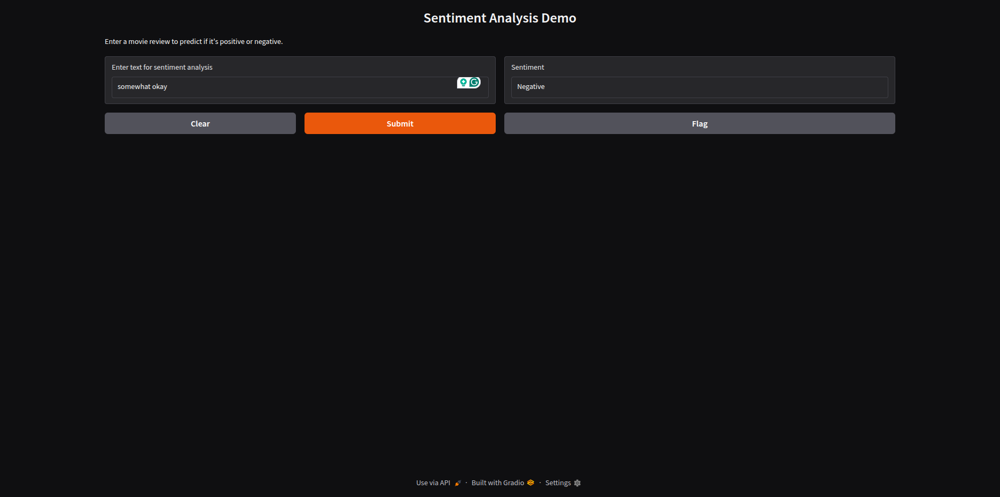

# Sentiment Analysis Project

This is an end-to-end machine learning project for sentiment analysis on movie reviews. It classifies text as positive or negative using a Logistic Regression model trained on the IMDB Dataset of 50K Movie Reviews from Kaggle.

## Project Overview

- **Problem**: Binary sentiment classification (positive/negative) of movie reviews.
- **Model**: Logistic Regression with bag-of-words features (CountVectorizer).
- **Dataset**: IMDB Dataset (50,000 reviews: 25,000 positive, 25,000 negative).
- **Frontend**: Gradio interface for user input and predictions.
- **Backend**: Scikit-learn model served via Joblib.

## Repository Structure
```bash
imdb-sentiment-analysis-project/
├── data/                           # Directory for datasets (download and place here)
│   └── IMDB Dataset.csv            # Downloaded from Kaggle (not committed to git)
├── docs/                           # Documentation files
│   └── report.md                   # Project report (convert to PDF)
├── models/                         # Saved models and artifacts
│   ├── model.joblib                # Trained model
│   └── vectorizer.joblib           # Fitted vectorizer
├── src/                            # Source code
│   ├── init.py                 # Makes src a package
│   ├── app.py                      # Gradio frontend and model serving
│   └── train.py                    # Training script
├── .gitignore                      # Git ignore file
├── README.md                       # This file
└── requirements.txt                # Dependencies
```

## Setup Instructions
To set up and run this project, follow these steps. We recommend using a virtual environment to manage dependencies safely.

### 1) Clone the repo
```bash
git clone https://github.com/salimsazzad/imdb-sentiment-analysis-project.git
```
### 2) Navigate to the project directory
```bash
cd imdb-sentiment-analysis-project
```

### 3) Create a virtual environment (venv)
This isolates dependencies and avoids conflicts with system Python.
```bash
python3 -m venv venv
```
_On Windows:_
```bash
python -m venv venv
```

### 4) Activate the virtual environment
_On Linux/macOS:_
```bash
source venv/bin/activate
```
_On Windows:_
```bash
venv\Scripts\activate
```

### 5) Install dependencies
With the venv active, run:
```bash
pip install -r requirements.txt
```
4. **Train the Model**:
```bash
python src/train.py
```
- This loads the dataset, preprocesses it, trains the model, evaluates accuracy, and saves artifacts to `models/`.
- Expected accuracy: ~85-90%.
- Training time: A few minutes on a standard machine.

6. **Run the Application**:
```bash
python src/app.py
```

- Launches a Gradio web interface.
- Access it via the URL printed in the console (e.g., http://127.0.0.1:7860).
- Enter a movie review text and get the predicted sentiment.

## Dependencies

- `scikit-learn`: Model training, vectorization, and evaluation.
- `gradio`: User-friendly web interface for predictions.
- `joblib`: Serializing and loading the model and vectorizer.
- `pandas`: Loading and handling the CSV dataset.

## Demo

- **Usage Example**:
- Input: "This movie was absolutely fantastic and thrilling!"
- Output: "Positive"

- Input: "What a waste of time, the plot was terrible."
- Output: "Negative"

- **Screenshots**:
- Sentiment-Analysis-Demo.png
  


## Notes

- The model uses CountVectorizer with a maximum of 5,000 features for efficiency. For improved performance, experiment with TF-IDF, more features, or advanced models like BERT (requires additional libraries like transformers).
- The dataset is balanced, but real-world data may require handling imbalances.
- Do not commit large files (e.g., dataset, models) to Git; they are ignored via `.gitignore`.
- For production, consider containerization with Docker or deployment on platforms like Heroku/Hugging Face Spaces.

## Report
Detailed in `report.md` (convert to PDF for submission).

